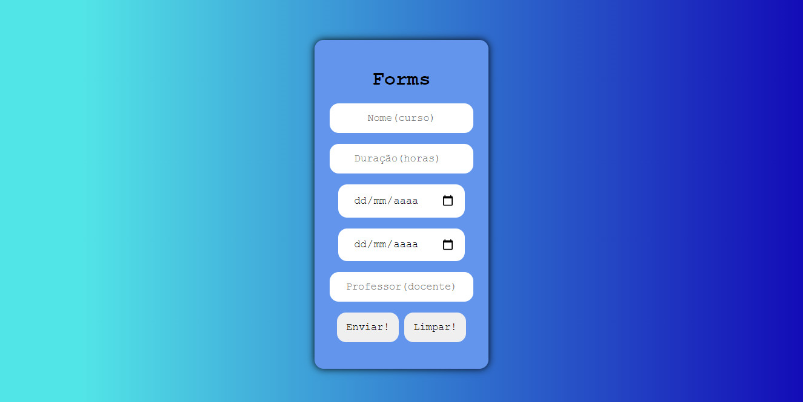

- União federativa (CPF) - Agosto 2021, por Vitor Benedito

Projeto: 

Dificuldades enfrentadas: 

A principal dificuldade enfrentada foi validar os campos onde será inserido String (letras), onde tive que criar uma condição que impedisse a inserção de caracteres especiais e números, isso usando a relação da tabela ASCII. Além tratei os dados de data para exibir as datas em formato brasileiro.

